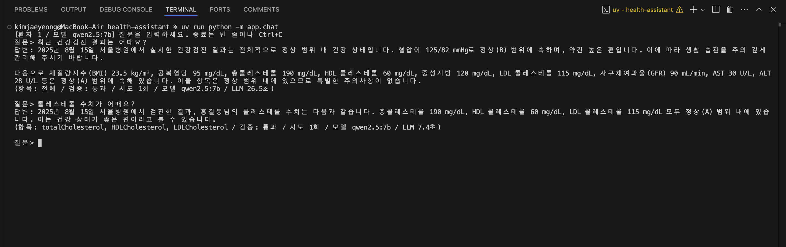
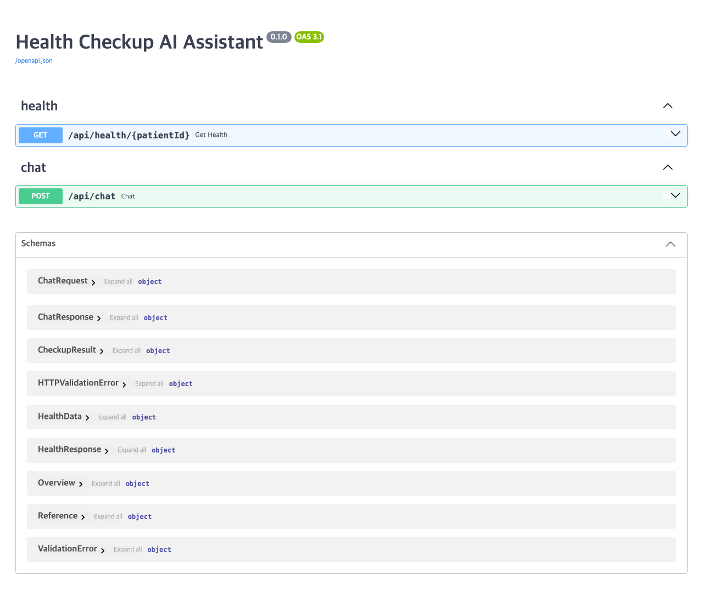
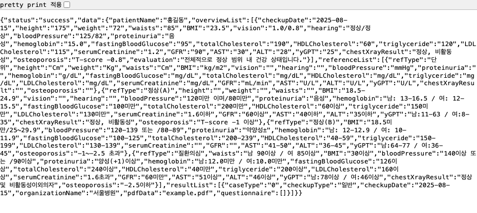

# Health Checkup AI Assistant

건강검진 데이터를 돌려주는 Mock API와 Ollama 로컬 LLM으로 검진 결과 질문에 답하는 서버이다.
질문 처리는 LangGraph 워크플로로 구성하였고 LLM 호출은 Ollama의 `/api/generate`를 사용한다.

### 1. 환경

- Python 3.13, uv, Ollama

```
brew install ollama
ollama serve                 # 별도 터미널에서 실행 유지
ollama pull qwen2.5:7b       # 기본 모델
```

모델 비교까지 돌려 보려면 gemma3:4b, llama3.1:8b도 pull한다.

### 2. 설치

```
cd health-assistant
uv sync
```

### 3. 실행

```
# 터미널 대화 (서버 불필요)
uv run python -m app.chat
uv run python -m app.chat --patient 2 --model gemma3:4b
uv run python -m app.chat -q "콜레스테롤 수치가 어때요?"

# HTTP 서버 (Swagger: http://localhost:8000/docs)
uv run python -m app
```

```
curl http://localhost:8000/api/health/1
curl -X POST http://localhost:8000/api/chat -H 'Content-Type: application/json' \
  -d '{"patientId": "1", "question": "최근 건강검진 결과는 어때요?"}'
```

### 4. 테스트

```
uv run pytest        # 97건, Ollama 없이 실행
uv run ruff check .
```

### 5. 환경 변수 (.env)

| 변수                   | 기본값                 | 설명                                        |
| ---------------------- | ---------------------- | ------------------------------------------- |
| OLLAMA_BASE_URL        | http://localhost:11434 | Ollama 서버                                 |
| OLLAMA_MODEL           | qwen2.5:7b             | 기본 모델 (요청마다 model 필드로 변경 가능) |
| OLLAMA_TIMEOUT_SECONDS | 120                    | 생성 대기 한도                              |
| DATA_DIR               | data/patients          | 환자 JSON 위치                              |

환자 데이터는 `data/patients/<patientId>.json`에 둔다. 1번은 안내서 예시 그대로이고 2번은 검진 2회분과 이상 수치를 포함한다.

### 6. API

| Method | Path                    | 설명                                                     |
| ------ | ----------------------- | -------------------------------------------------------- |
| GET    | /api/health/{patientId} | 건강검진 데이터 조회 (안내서 Response Format 그대로)     |
| POST   | /api/chat               | 질문에 대한 답변. body: patientId, question, model(선택) |

/api/chat 응답에는 답변 외에 사용한 항목(metrics), 검증 통과 여부(verified)와 사유, 시도 횟수, 모델, LLM 소요 시간이 포함된다.

### 7. 구조

```
app/
  main.py
  __main__.py
  chat.py
  core/             settings, lifespan
  routers/          health, chat
  schemas/          health, chat
  repositories/     patient (환자 JSON), health_api (Mock API 호출)
  services/         reference (참고치 판정), metrics (항목 키워드), prompts, llm (Ollama 호출),
                    graph (LangGraph 워크플로), verify (답변 검증), assistant (그래프를 감싼 서비스)
  types/            agent_state
data/patients/      환자 JSON
scripts/            compare_models.py (모델 비교)
```

질문 처리 흐름 (LangGraph)

```
fetch_health -> select_metrics -> build_context -> generate_answer -> verify_answer -> END
                                                        ^                  |
                                                        +----- 재생성 1회 ---+
```

- fetch_health: Mock API 호출
- select_metrics: 질문 키워드로 관련 항목 선택. 없으면 전체 요약
- build_context: 항목별 값, 단위, 참고치, 판정을 텍스트로 구성. 판정은 코드에서 계산
- generate_answer: `/api/generate` 호출 (LLM 호출은 여기 한 곳)
- verify_answer: 한국어 여부, 데이터에 없는 수치, 무관 항목, 판정 불일치 검사. 걸리면 사유를 붙여 한 번 재생성

### 8. 구현하면서 정한 것

- 참고치 판정은 LLM에 맡기지 않고 코드에서 처리한다. 7b 모델은 "125가 120 미만인가" 같은 범위 비교를 자주 틀린다.
- 참고치 문자열("100미만", "18.5미만/25~29.9", "남: 13-16.5 / 여: 12-15.5", 혈압의 "이며/또는")을 파싱해서 구간으로 변환한다. 규칙 밖 문자열은 판정하지 않는다.
- 성별이 데이터에 없어서 성별 분기 항목은 남녀 판정이 같을 때만 확정한다.
- LLM 호출은 질문당 1회로 제한한다. 로컬 모델은 호출당 수 초라 항목 선택까지 LLM에 맡기면 응답이 두 배가 된다.
- 검증 4가지는 실제 응답에서 나온 오류를 보고 하나씩 추가하였다 (경위: docs/prompt-iterations.md).
- 테스트는 가짜 LLM과 httpx ASGITransport/MockTransport로 Ollama 없이 실행한다.

### 9. 모델 비교

같은 질문 6개를 후보 모델 3개에 실행 (Apple M3 16GB). 상세: docs/model-comparison.md

| 모델              | 크기  | 평균 응답 | 정확한 답 | 검증이 잡은 오류 | 검증이 놓친 오류 |
| ----------------- | ----- | --------- | --------- | ---------------- | ---------------- |
| qwen2.5:7b (기본) | 4.7GB | 21초      | 4/6       | 1                | 1                |
| llama3.1:8b       | 4.9GB | 17초      | 4/6       | 1                | 1                |
| gemma3:4b         | 3.3GB | 14초      | 2/6       | 3                | 1                |

qwen2.5:7b를 선택하였다. 정확도는 llama와 같지만 규칙(검진일, 값과 단위, 판정 이름) 준수와 한국어가 가장 안정적이다. llama는 답이 두 배 길고 앞뒤 모순이 있었고, gemma는 빠르지만 정상 항목에 다른 판정을 붙이는 오류가 많았다. 같은 모델도 실행마다 답이 달라서 한 번의 결과로 단정하지는 않는다.

### 10. 스크린샷

터미널 대화



Swagger, Mock API 응답





### 11. AI 도구 사용

Claude Code를 사용하였다. 범위와 방식, 사용한 프롬프트는 docs/ai-usage.md, 프롬프트 개정 과정은 docs/prompt-iterations.md에 정리하였다.

### 12. 한계와 보완할 점

- 검증은 수치, 항목, 판정 이름의 일치까지만 확인한다. "다른 항목은 모두 정상"처럼 항목 이름 없는 단정은 잡지 못한다.
- 참고치 파서는 자주 나오는 형태만 처리하며 표의 빈 구간(LDL 140~159 등)은 "참고 범위 사이의 값"으로 표시한다.
- 대화 기억과 스트리밍은 없다. 각각 LangGraph 체크포인터와 `/api/generate`의 stream 옵션으로 붙일 수 있다.
